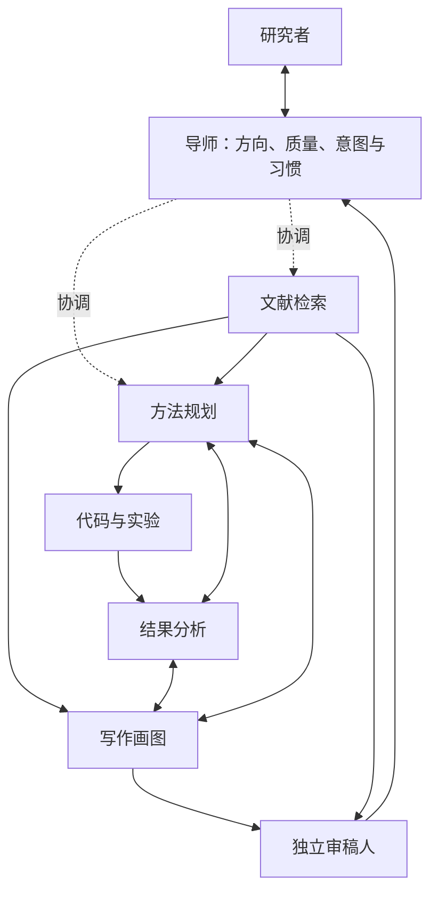

# 七 Agent 研究架构

按七种可复用职责组织 AI 研究。代码角色合并数据或环境接入、实现、调试与实验执行；写作角色同时负责科研画图；导师承接总体协调与个性化。允许按任务增加临时专长或合并调用，七类职责作为起点，具体分工随项目调整。

## 职责与可复用指令

| ID | 角色与指令 | 核心交付 |
|---|---|---|
| `literature` | [文献检索](../agents/literature.md) | 有原文依据的解法、局限、baseline、迁移与写法参考 |
| `method` | [方法规划](../agents/method.md) | 与研究者共同制定的方法、验证实验、可行性与优化方案 |
| `code` | [代码与实验](../agents/code.md) | 数据接入、baseline、方法与消融实现、运行和复现记录 |
| `analysis` | [结果分析](../agents/analysis.md) | 结果比较、失败诊断、分析脚本与下一步建议 |
| `writing` | [写作画图](../agents/paper-writer.md) | 广泛阅读后的论证、正文、方法图、结果图与可编辑来源 |
| `reviewer` | [审稿人](../agents/manuscript-reviewer.md) | 独立补查原文后的实质审稿与最小修订建议 |
| `mentor` | [导师](../agents/mentor.md) | 方向与质量统筹、意图澄清、优先级、自我复查与习惯总结 |

所有角色遵循[共享原则](../agents/README.md)：优先检索和复用已有工作，读取相关用户偏好，用实际文献和产物支持判断。专业工具是角色可调用的能力，不必每项工具都包装成一个常设 Agent。

## 协作示意

箭头表示常见协作，不是固定阶段门禁。导师可以直接安排任一角色；重要意图不清时与你确认，明确的工作继续进行。研究者可随时进入方法、实验、写作和结果讨论。

## 工作如何分配

- **有 idea 与初始解法：** 导师理解目的，文献检索先查同问题解法、局限与基线，再与方法规划比较可迁移方法。
- **要验证方法：** 方法规划与你确定最有信息量的比较，代码角色反馈数据和工程可行性，随后实现并在约定预算内运行。
- **需要优化：** 结果分析与方法规划联合解释现象，代码执行有价值的下一轮；导师帮助判断是否值得继续投入。
- **开始写作：** 写作画图角色自己阅读关键原文和同类写法，用分析提供的真实结果组织文章与图表；缺口反馈到方法、分析或文献检索。
- **最终审稿：** 审稿人独立补查、核读原文，提出影响贡献和结论的问题。导师汇总优先级和处理方案，保留审稿原意与有依据的分歧，用户判断重大取舍。

导师也复查自己的假设、优先级和用人方式；自评不能替代独立文献或实验，更不能替代最终审稿。日常不增加逐项签收。

## 容易重叠的职责

| 工作 | 负责人 | 协作边界 |
|---|---|---|
| 数据与评价设置 | 方法规划决定科研设计，代码负责实现 | 分析检查口径与结果，重要取舍与你讨论 |
| 方法优化 | 方法规划与结果分析联合 | 代码实现和运行，导师关注优先级与价值 |
| 科研图表 | 写作画图负责最终图与图注 | 分析负责数值、统计和含义；共享来源与生成入口 |
| 质量判断 | 导师持续关注方向与协作 | 审稿人保留独立的最终实质审查 |
| 个人习惯 | 导师维护本地用户档案并共享相关偏好 | 其他角色提交有来源的观察，显式偏好和推断分开 |

## 最小上下文与执行

一份研究笔记串起问题、方法、实验计划和发现；共享阅读索引保存来源与阅读深度；代码配置、日志和分析产物保存实际执行。任务只需负责人、目标、必要输入、交付和资源边界，直接用文件链接交接。

文献来源、编辑器、记录工具与本地或远程执行环境按[个性化配置](../profiles/README.md)和项目条件选择，不绑定特定模型或平台。长实验由代码角色保存进程或作业标识和产物位置，断线先查状态。并行修改隔离后再合并，资源按既有预算和执行环境安排。运行是否成功以真实输出为准。

每项重要研究决策优先检查已有参考；已有阅读可复用，新的机制、比较或异常触发补查。广泛读文献与保持轻量流程可以同时做到，阅读细节放共享索引，报告聚焦判断。

## 架构如何继续调整

七个核心角色足以作为起点。导师依据实际重复问题调整任务粒度：大量独立实验可增加临时代码实例，跨领域论文可分配领域检索子任务；稳定重复动作沉淀为 Skill。只有持续工作量、工具或专业判断边界需要时才增设角色，避免为一个新任务永久增加 Agent。

调整理由与效果保留在笔记中，例如是否减少返工、改善问题定位或减轻用户负担。写作和最终审稿仍保留独立阅读与判断。
